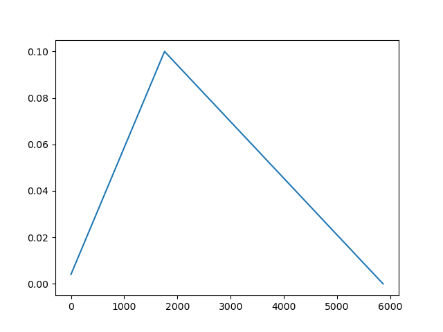
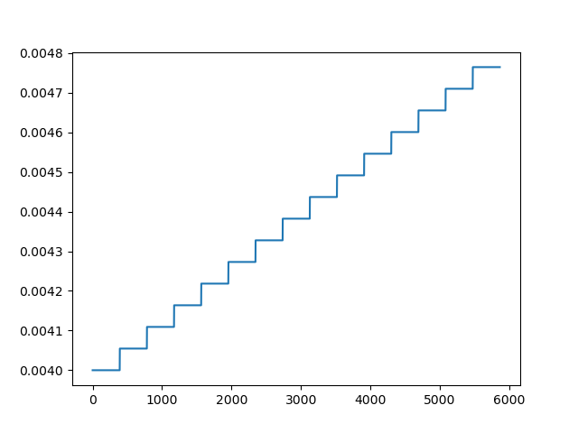
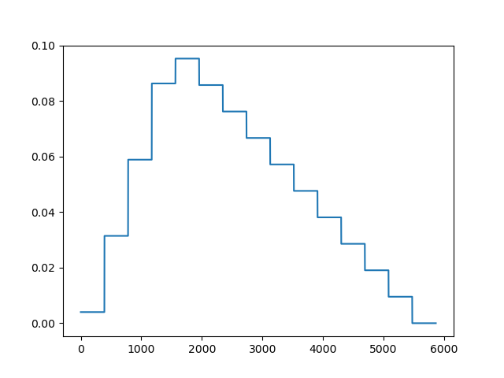

# PyTorch Scheduler

## The code
to get `lr` there are 2 ways:
```python
optimizer.param_groups[0]['lr']
lr_scheduler.get_last_lr()[0]
```

run on your windows laptop, with cache Cifar10, it benchmarked:
```
loading saved cache
loading saved cache
epochs: 15, batches: 391
epoch: 0/15 t_ep:  3.1730058193206787 t_load:  2.834516763687134 t_opt:  0.001996278762817383 t_sch:  0.0
epoch: 1/15 t_ep:  3.109074592590332 t_load:  2.7909886837005615 t_opt:  0.0012085437774658203 t_sch:  0.0
epoch: 2/15 t_ep:  3.1410350799560547 t_load:  2.8216917514801025 t_opt:  0.0040013790130615234 t_sch:  0.0
epoch: 3/15 t_ep:  3.136692762374878 t_load:  2.7940821647644043 t_opt:  0.016641855239868164 t_sch:  0.0
epoch: 4/15 t_ep:  3.1098215579986572 t_load:  2.7704358100891113 t_opt:  0.003002166748046875 t_sch:  0.0
epoch: 5/15 t_ep:  3.1487274169921875 t_load:  2.827030658721924 t_opt:  0.007508277893066406 t_sch:  0.0
epoch: 6/15 t_ep:  3.1370251178741455 t_load:  2.800105571746826 t_opt:  0.009124517440795898 t_sch:  0.0
epoch: 7/15 t_ep:  3.237657308578491 t_load:  2.881941795349121 t_opt:  0.0176241397857666 t_sch:  0.0
epoch: 8/15 t_ep:  3.1630492210388184 t_load:  2.845980405807495 t_opt:  0.0 t_sch:  0.0
epoch: 9/15 t_ep:  3.2489418983459473 t_load:  2.8684730529785156 t_opt:  0.022287368774414062 t_sch:  0.0
epoch: 10/15 t_ep:  3.2665324211120605 t_load:  2.936586618423462 t_opt:  0.0009975433349609375 t_sch:  0.0
epoch: 11/15 t_ep:  3.1939187049865723 t_load:  2.8406240940093994 t_opt:  0.032460689544677734 t_sch:  0.0
epoch: 12/15 t_ep:  3.1691370010375977 t_load:  2.80287766456604 t_opt:  0.020147323608398438 t_sch:  0.0
epoch: 13/15 t_ep:  3.221451997756958 t_load:  2.8811237812042236 t_opt:  0.01760697364807129 t_sch:  0.0
epoch: 14/15 t_ep:  3.123867988586426 t_load:  2.775982141494751 t_opt:  0.03423738479614258 t_sch:  0.0
```
most of the epoch is wasted on loading the data (despite not being used). we see that optimizer time is 1-30ms on a CPU with a 2-neuron network, while scheduler step was ngeligible.

## Schedulers

### OneCycleLR
Will have a ramp, peak at the `pct_start` step with a value of `max_lr`. 
```python
scheduler = torch.optim.lr_scheduler.OneCycleLR(
    optimizer,
    max_lr=cfg.max_lr,
    steps_per_epoch=len(train_dl),
    epochs=cfg.epochs,
    anneal_strategy='linear'
)
```
For this config, a full cycle will take `steps_per_epoch` * `epochs` number of steps.


## When to step
There's a difference on when you run `scheduler.step()`. If you step on each batch:
```python
for epoch in range(20):
    for input, target in dataset:
        ...
        optimizer.step()
        scheduler.step()
```


here it's smooth and it complete it's full ramp

But in the [reference](https://pytorch.org/docs/stable/optim.html#how-to-adjust-learning-rate) it is recommended to run it on epoch like so (disclaimer, the example uses `ExponentialLR`):
```python
for epoch in range(20):
    for input, target in dataset:
        optimizer.zero_grad()
        output = model(input)
        loss = loss_fn(output, target)
        loss.backward()
        optimizer.step()
    scheduler.step()
```


here, it's suppose to be triangle, but it only has a portion of the ramp. also you can see the steps, indicating the `lr` did not change for the full epoch.

If we want the step on each epoch scheduling, then we need to give `total_steps=cfg.epochs`. in this way, the scheduler will have a full cycle of just the number of epochs. here's the graph of it:

